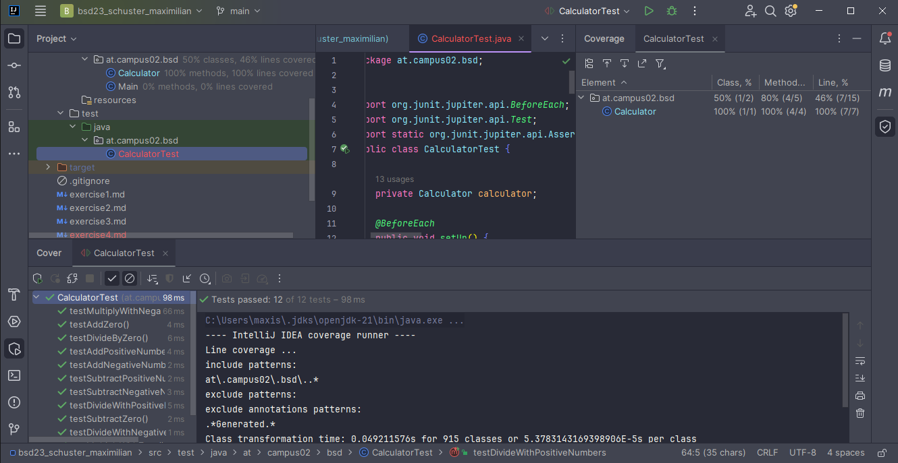

# Exercise 4 - Testing the Calculator

## Test Cases

### Addition Tests
- **Test Case 1**: Add two positive numbers (e.g., `add(5, 3)`).
- **Test Case 2**: Add a positive number and zero (e.g., `add(5, 0)`).
- **Test Case 3**: Add two negative numbers (e.g., `add(-5, -3)`).

### Subtraction Tests 
- **Test Case 1**: Subtract a smaller number from a larger number (e.g., `subtract(5, 3)`).
- **Test Case 2**: Subtract a number from itself (e.g., `subtract(5, 5)`).
- **Test Case 3**: Subtract a number from zero (e.g., `subtract(0, 5)`).

### Multiplication Tests 
- **Test Case 1**: Multiply two positive numbers (e.g., `multiply(5, 3)`).
- **Test Case 2**: Multiply a number by zero (e.g., `multiply(5, 0)`).
- **Test Case 3**: Multiply two negative numbers (e.g., `multiply(-5, -3)`).

### Division Tests 
- **Test Case 1**: Divide a number by a smaller number (e.g., `divide(10, 5)`).
- **Test Case 2**: Divide a number by a larger number (e.g., `divide(5, 10)`).
- **Test Case 3**: Test division by zero (e.g., `divide(5, 0)`), expecting an `ArithmeticException`.

 
