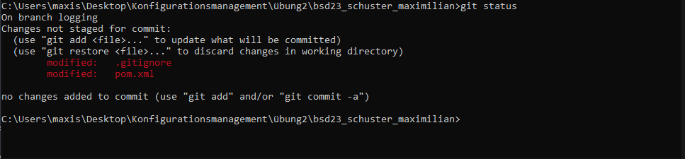
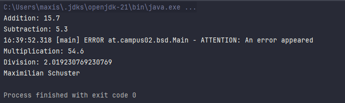
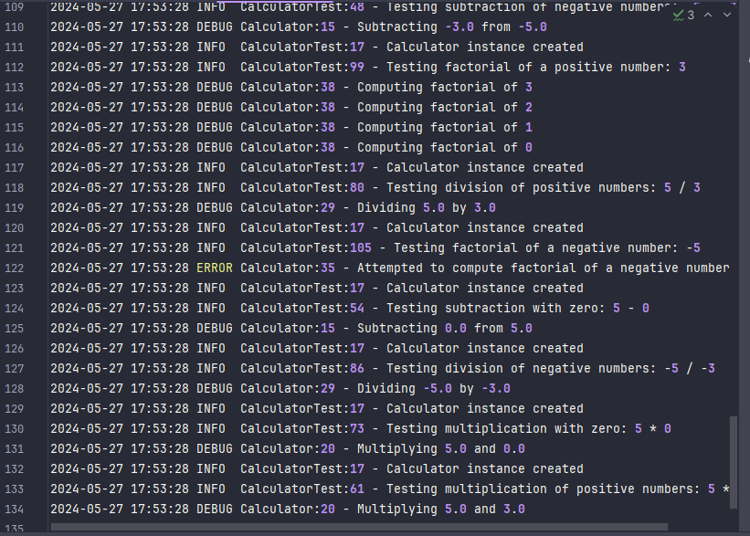
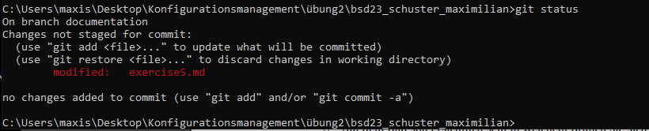

# Logging-Dokumentation des Projekts

## Warum werden Logging-Bibliotheken verwendet?
Die Logging-Bibliothek dient dazu, Informationen über den Betrieb der Software zu erfassen. Dies kann von sehr grundlegenden Log-Nachrichten reichen, die den Ablauf der Ausführung zeigen, bis hin zu recht detaillierten diagnostischen Daten, die bei der Fehlersuche hilfreich sein können.

## Log4J Log-Level
Log4J bietet verschiedene Log-Level, die dabei helfen, die Wichtigkeit der protokollierten Nachrichten zu kategorisieren. Diese umfassen:

- **ERROR**: Probleme, die zu einem Prozessausfall führen können.
- **WARN**: Probleme, die nicht sofort kritisch sind, aber später Schwierigkeiten verursachen könnten.
- **INFO**: Allgemeine Nachrichten, die lediglich den Fortschritt der Anwendung anzeigen.
- **DEBUG**: Detaillierte Informationen, die typischerweise nur zur Identifikation von Problemen nützlich sind.
- **TRACE**: Detaillierter als DEBUG, bietet umfassende Trace-Informationen.

## Log4J Konfigurationsoptionen
Es gibt viele Konfigurationsoptionen in Log4J:

- Definieren von Ausgabestilen und Log-Formaten.
- Festlegen des Log-Level für bestimmte Teile der Anwendung.
- Weiterleiten von Log-Nachrichten an verschiedene Zielorte wie Dateien, Datenbanken oder Netzwerk-Sockets.

