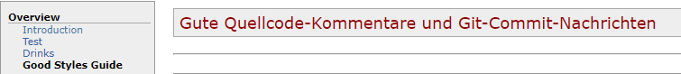
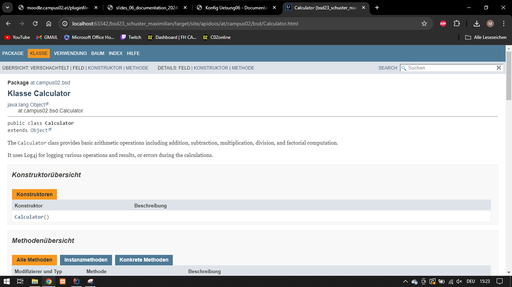
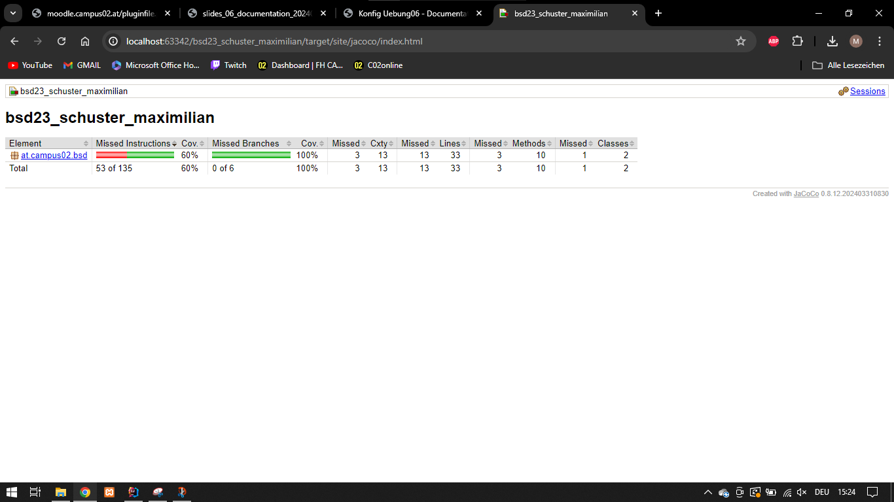

## Erstellung der Maven Site Dokumentation

### Voraussetzungen
Für die Generierung einer umfassenden Maven Site Dokumentation müssen mehrere Plugins und Konfigurationen in der `pom.xml` und `site.xml` eingebunden werden.

### `pom.xml` Konfigurationen
- **Maven Site Plugin**: Grundlegendes Plugin zur Erstellung der Site. Es muss im `build`-Teil der `pom.xml` spezifiziert werden.
- **Zusätzliche Plugins**:
    - **Maven Project Info Reports Plugin**: Erstellt Berichte über das Projekt.
    - **Maven Javadoc Plugin**: Generiert die API-Dokumentation.
    - **JaCoCo Plugin**: Fügt Berichte über die Testabdeckung hinzu.
- **Plugin-Konfiguration**: Diese Plugins werden unter den `build` und `reporting` Tags der `pom.xml` konfiguriert, um sicherzustellen, dass sowohl der Build-Prozess als auch die Berichtserstellung korrekt ablaufen.

### `site.xml` Konfigurationen
- **Menüstruktur**: Definiert die Navigation der Site. Hier werden spezifische Berichte und Seiten, die in der Site erscheinen sollen, organisiert.
- **Skin und Layout**: Die optische Gestaltung der Site kann durch das `<skin>`-Tag angepasst werden.
- **Eigene Seiten**: Markdown- oder APT-Formatierte Seiten können spezifiziert werden, um zusätzliche Inhalte wie Tutorials oder Projektbeschreibungen einzubinden.

### Schlussfolgerung
Die Konfiguration der `pom.xml` und `site.xml` ist entscheidend für die Erstellung einer informativen und gut strukturierten Maven Site. Die korrekte Einrichtung dieser Dateien ermöglicht eine nahtlose Integration von Projektberichten, Dokumentation und anderen Ressourcen in die finale Dokumentations-Website.

---

Diese Zusammenfassung bietet eine klare Anleitung, die Sie direkt in Ihr Markdown-Dokument für Ihre Übung einfügen können. Sie erklärt die Schlüsselaspekte und liefert ein praktisches Beispiel für die `site.xml` Konfiguration.

